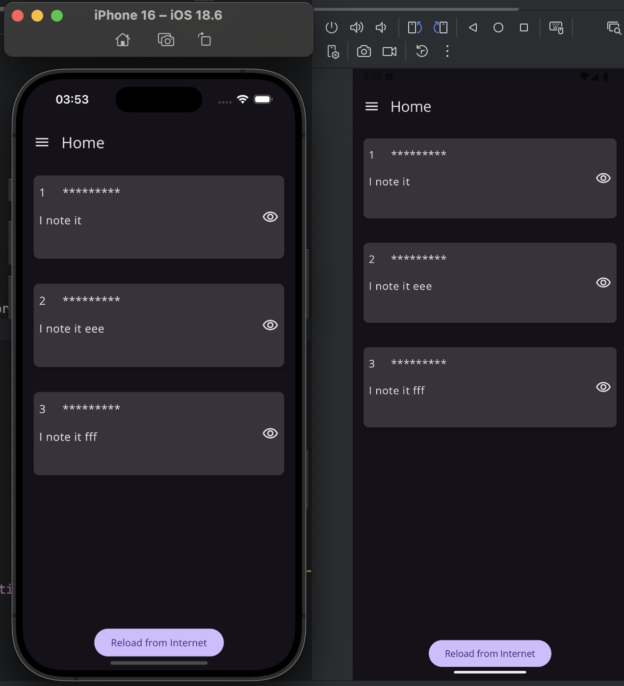

This is a Kotlin Multiplatform project targeting Android, iOS, Server.

* [/composeApp](./composeApp/src) is for code that will be shared across your Compose Multiplatform applications.
  It contains several subfolders:
    - [commonMain](./composeApp/src/commonMain/kotlin) is for code that’s common for all targets.
    - Other folders are for Kotlin code that will be compiled for only the platform indicated in the folder name.
      For example, if you want to use Apple’s CoreCrypto for the iOS part of your Kotlin app,
      the [iosMain](./composeApp/src/iosMain/kotlin) folder would be the right place for such calls.
      Similarly, if you want to edit the Desktop (JVM) specific part, the [jvmMain](./composeApp/src/jvmMain/kotlin)
      folder is the appropriate location.

* [/iosApp](./iosApp/iosApp) contains iOS applications. Even if you’re sharing your UI with Compose Multiplatform,
  you need this entry point for your iOS app. This is also where you should add SwiftUI code for your project.

* [/server](./server/src/main/kotlin) is for the Ktor server application.

* [/shared](./shared/src) is for the code that will be shared between all targets in the project.
  The most important subfolder is [commonMain](./shared/src/commonMain/kotlin). If preferred, you can add code to the
  platform-specific folders here too.

Learn more about [Kotlin Multiplatform](https://www.jetbrains.com/help/kotlin-multiplatform-dev/get-started.html)…

Netty server setup:

const val BASE_URL = "http://192.168.1.40:8080"

Android Manifest.xml for Netty Server:

android:usesCleartextTraffic="true"

ios plist file for Netty Server:

<pre>
<?xml version="1.0" encoding="UTF-8"?>
<!DOCTYPE plist PUBLIC "-//Apple//DTD PLIST 1.0//EN" "http://www.apple.com/DTDs/PropertyList-1.0.dtd">
<plist version="1.0">
    <dict>
        <key>CADisableMinimumFrameDurationOnPhone</key>
        <true/>
        <key>NSAppTransportSecurity</key>
        <dict>
            <key>NSExceptionDomains</key>
            <dict>
                <key>localhost</key>
                <dict>
                    <key>NSExceptionAllowsInsecureHTTPLoads</key>
                    <true/>
                </dict>
            </dict>
        </dict>
    </dict>
</plist>
</pre>

For support gesture on Navigation Drawer Menu

    BackHandler(enabled = true) {
        println("BackHandler")
        onStartClick.invoke()
    }
